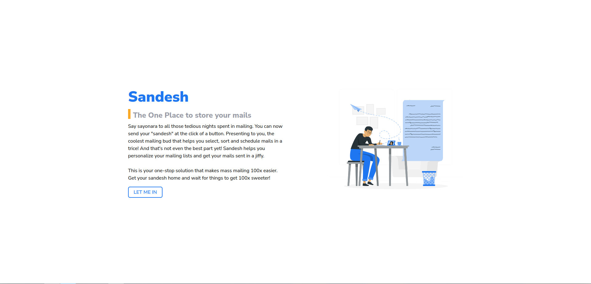

<div align="center">
  <a href="https://srmkzilla.net"> </a> 
</div>
<div align="center">
  
</div>

<br>
<p align="center">
Mailing made Easy. 💌
</p>
<p align="center">
crafted with <span style="color: #8b0000;">&hearts;</span> by your friends on the <a href="https://srmkzilla.net">SRMKZILLA</a> team.
</p>
<p align="center">
    
    
    
</p>

> Meet Sandesh. An Open Source mass mailer built for everyone. 🚀  
> _\* No conditions here. Seriously._

## Preview 📺

<div align="center">
  
</div>

# Installation 🔧

## Install dependencies and build the server
 
```
$ yarn && yarn build
```

## Start the server

```
$ yarn start
```
## Start the dev server

```
$ yarn dev
```


<br>
<br>

# Start the Client

## Move into the client directory

```
$ cd client
```

## Install client dependencies and start the application


```
$ yarn && yarn start
```
## Note: You must add your own enviroment variables. Checkout the `env.example` and make a `.env` file before starting the application.
<br>


## License 📜

`Sandesh` is available under the MIT license. See the LICENSE file for more info.

## Contributing 🤝

Please read `Contributing.md` for details on our code of conduct, and the process for submitting pull requests to us.

## Shout outs 💥

A huge shout out to the amazing devs without whom none of this would've been possible.


| <p align="center"><br>[Aayushi Goenka](https://github.com/aayushi-goenka)</p>  | <p align="center"><br>[Devesh Teotia](https://github.com/deveshteotia12)</p> | <p align="center"><br>[Viraj Agarwal](https://github.com/agarwalviraj)</p>| <p align="center"><br>[Snehil](https://github.com/SneakySensei)</p>
| ----------- | ---------- |------ | ----- |
## Forking this repo 🚨

Many people have contacted us asking if they can use this code for their own websites. The answer to that question is usually "yes", with attribution. There are some cases, such as using this code for a business or something that is greater than a personal project, that we may be less comfortable saying yes to. If in doubt, please don't hesitate to ask us.

We value keeping this site open source, but as you all know, _**plagiarism is bad**_. We spent a non-negligible amount of effort developing, designing, and trying to perfect this iteration of our website, and we are proud of it! All we ask is to not claim this effort as your own.

So, feel free to fork this repo. If you do, please just give us proper credit by linking back to our website, https://srmkzilla.net. Refer to this handy [quora post](https://www.quora.com/Is-it-bad-to-copy-other-peoples-code) if you're not sure what to do. Thanks!

## Our community 🧑🏻‍🤝‍🧑🏽

If you run into any issues while installing, running or contributing to this code base, reach out to us on our [Discord Server](https://community.srmkzilla.net/) or email us at technical@srmkzilla.net .


